# Kaali

**Kaali- Symbol of strength, protection and fearlessness**

[Open Kaali](https://kaali-ui4n.onrender.com) · Delhi NCR early access

## Screenshots

Captured from the live website. Red circles show historical recorded volume; locality shading is experimental advisory context.

| Page | Light | Dark |
| --- | --- | --- |
| Map | 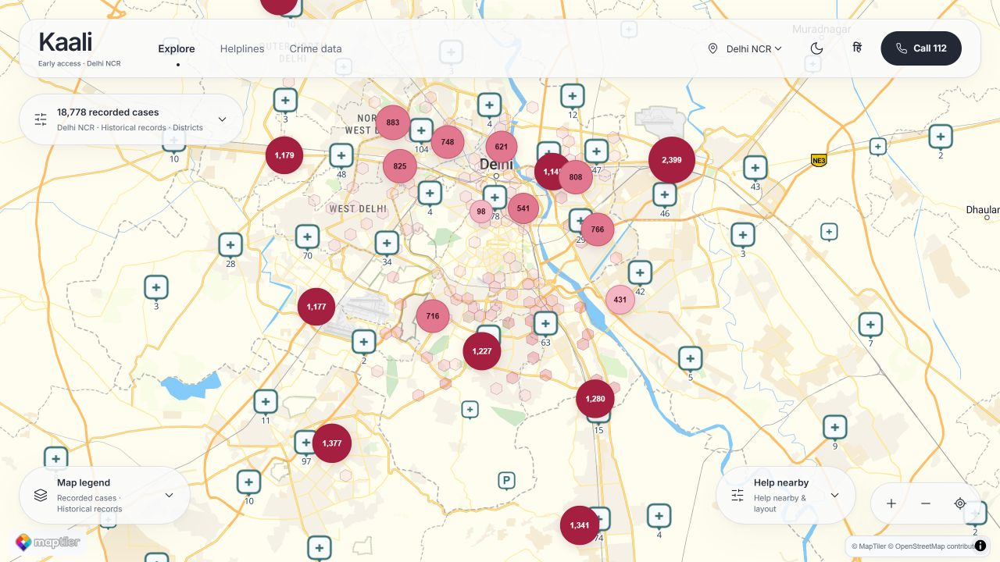 | 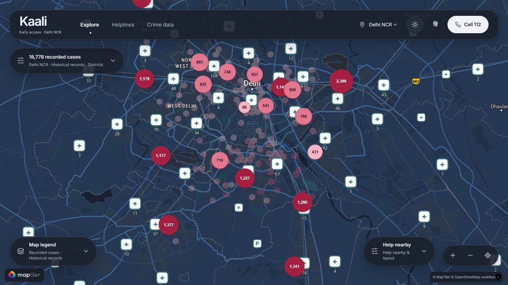 |
| Helplines | 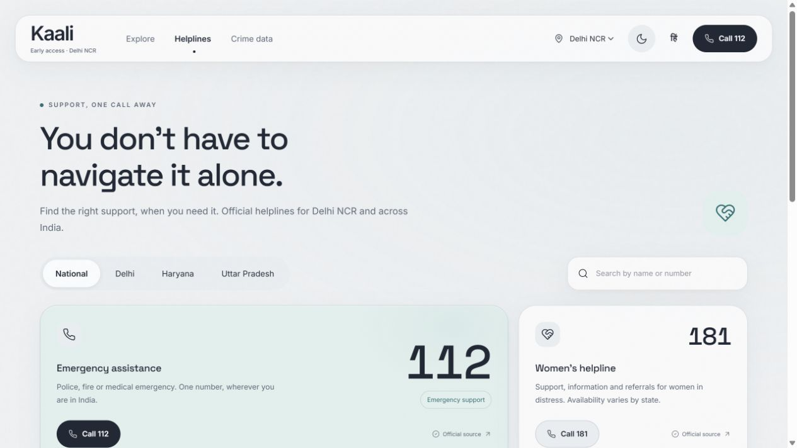 | 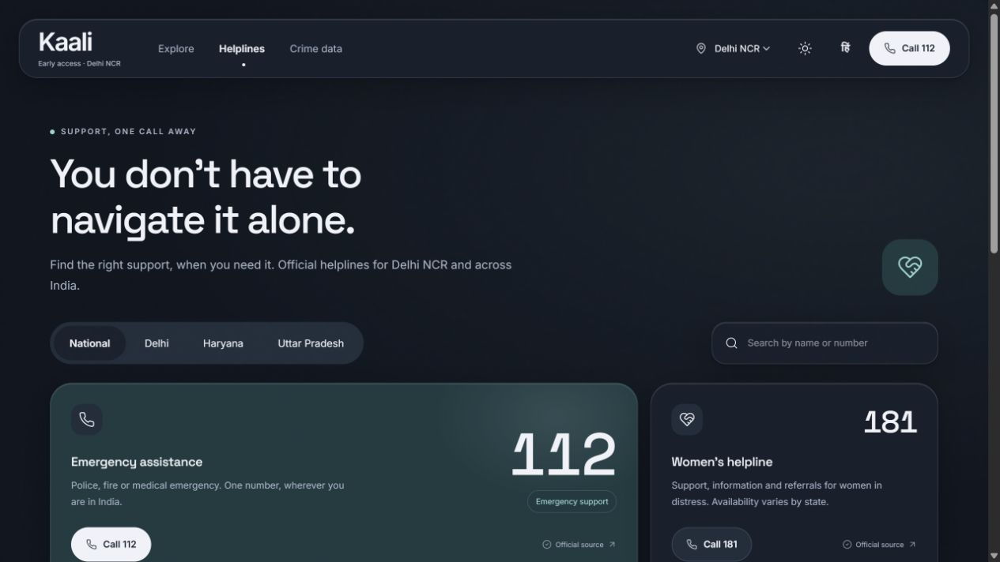 |
| Crime data | 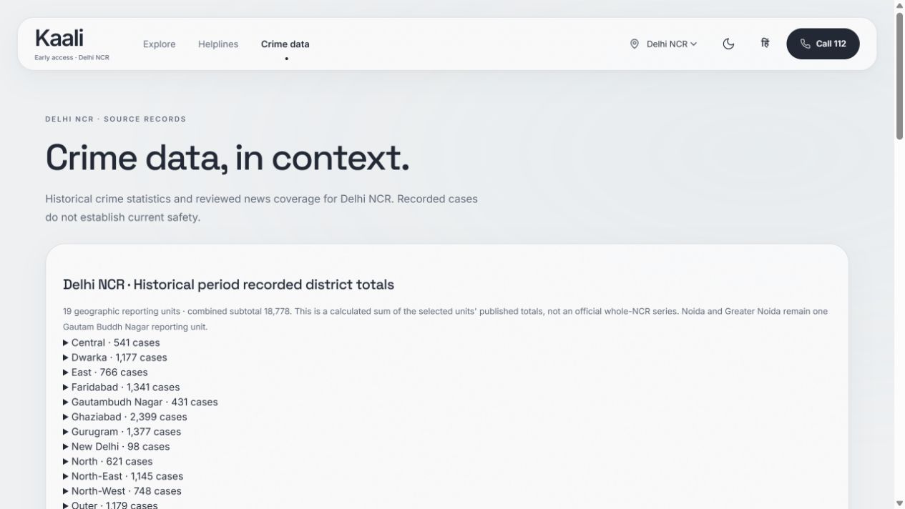 | 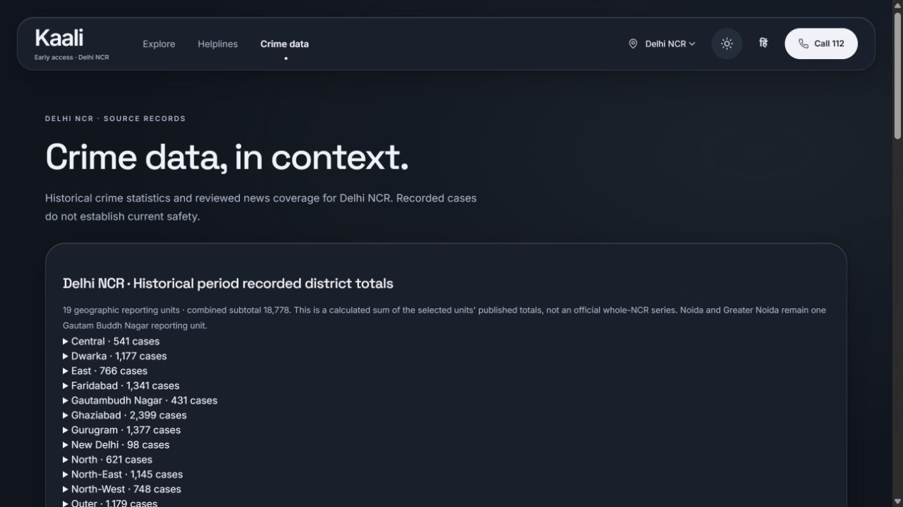 |

<details>
<summary>Mobile screenshots</summary>

| Page | Light | Dark |
| --- | --- | --- |
| Map | 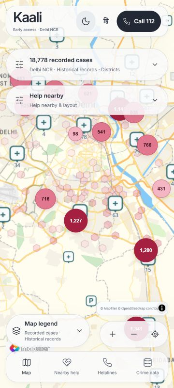 | 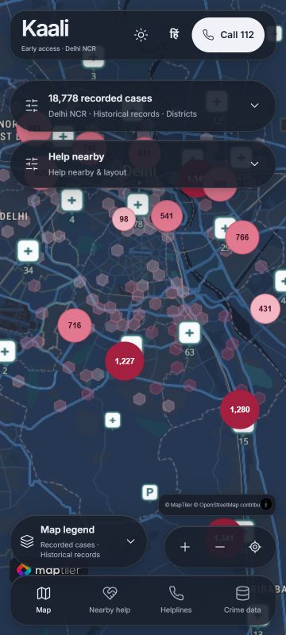 |
| Helplines | 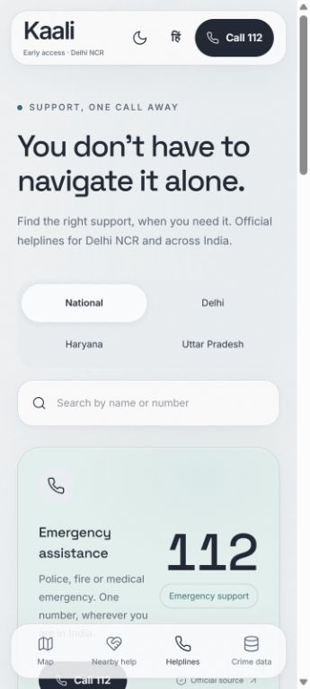 | 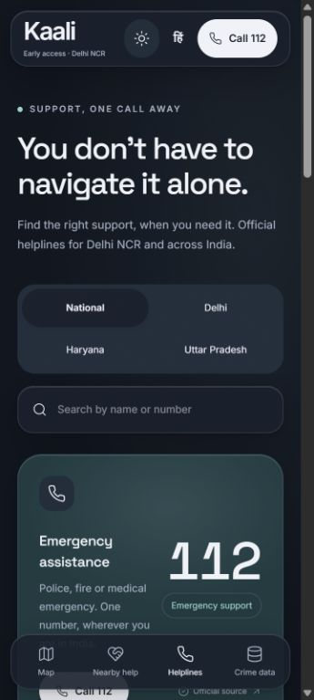 |
| Crime data | 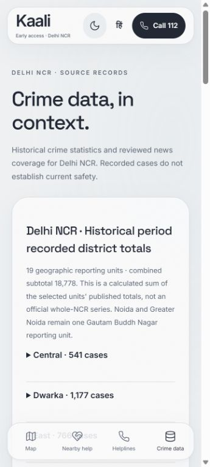 | 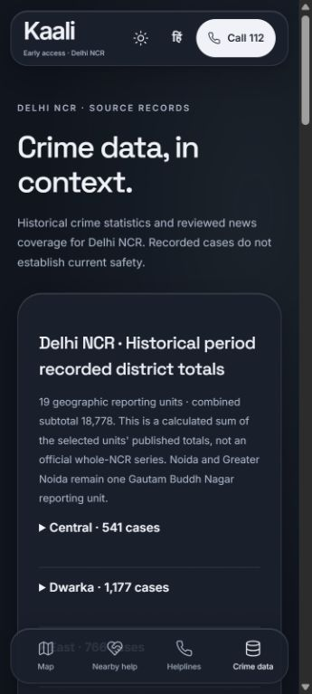 |

</details>

## Delhi NCR early access: complete

Version `0.1.0-early-access` is the completed Delhi NCR early-access scope. It is an awareness map, not a validated prediction of individual safety or a real-time crime/traffic service.

### Included

- MapLibre GL / react-map-gl map with MapTiler light/dark, satellite and catalogue layouts.
- Historical recorded-case circles for 15 Delhi police districts plus Gurugram, Faridabad, Gautam Buddh Nagar and Ghaziabad. The selected-unit subtotal is 18,778; it is not an official whole-NCR total. Noida/Greater Noida share one reporting unit.
- District search, category breakdowns, source links and collapsible glass controls.
- Automatic transparent reference-cell advisory levels. Fitted annual-volume modelling, assumed spatial/context adjustments and time-only fallback remain clearly distinguished from measured records.
- Police/hospital help layers on by default; metro optional. Partial OSM snapshot, with unconfirmed facilities/availability.
- Consent-based device location, blue accuracy marker, automatic zoom for previously granted permission, collapsible detailed on-device precautions, optional native sharing and Stop location.
- Official helpline resources, crime-data/evidence page, persistent Emergency 112, responsive layouts and English/Hindi navigation foundations.
- No accounts, tracking, stored GPS, victim data, offender profiles or cloud AI calls in the current location flow. Theme/recent search preferences stay local.

### Data and model limits

Historical circles use approximate public-place references, not verified police boundaries or incident locations. Their red bands and screen-pixel sizes are display choices; edges are not danger radii. Source years remain in exports/audit records; the interface uses Historical period labels.

The latest Poisson model uses 109 real reporting-unit lag/target examples across Delhi, Haryana and UP. Pooled held-out MAE is 160.99 cases versus persistence 165.55; combined NCR city transfer is worse than persistence. Future annual extrapolation and neighbourhood interpolation are experimental. No measured neighbourhood crime counts or calibrated crime probabilities are fabricated. See [model card](data-pipeline/reports/ml-volume-v1/MODEL_CARD.md).

Missing model/context values use requested assumed local-time advisories: 20:00–06:00 High, 06:00–10:00 Medium, 10:00–17:00 Low, 17:00–20:00 Medium. Available model Low/Medium levels upgrade at 22:00–06:00; outer/lower-density references have a High minimum then. Outer means over 20 km from the configured region centre; lower density is relative to available supplied density values. These are assumptions, not official classifications. Raw missing crime/model values stay null.

Supplied road-probe samples are historical, not live traffic/footfall. Swapped population coordinate headings were corrected in memory; missing area never becomes invented density. Original source/reuse receipts and matching police geography remain research gaps. Early access completion does not close those scientific gaps.

## Run locally

Requirements: Node 22 and pnpm 11.19.0.

```sh
corepack pnpm install --frozen-lockfile
```

Copy `.env.example` to `.env.local` and set `VITE_MAPTILER_KEY`. Restrict the client key to your local and deployed HTTP referrers in MapTiler; it is included in the frontend bundle by design. Never commit `.env.local`. Optional style/geocoder configuration is documented in `.env.example`.

```sh
corepack pnpm dev
corepack pnpm typecheck
corepack pnpm lint
corepack pnpm test
corepack pnpm validate:data
corepack pnpm build
```

## Render deployment

Use a Render **Static Site**, branch `master`, build command `corepack pnpm install --frozen-lockfile && corepack pnpm build`, publish directory `dist`, Node 22. Set `VITE_MAPTILER_KEY` in Render's build environment, and add the deployed domain to its MapTiler referrer restrictions. Rewrite `/*` to `/index.html` for direct `/helplines` and `/evidence` requests. `render.yaml` records this setup; its key entry is a prompt, not a committed secret. Official guidance: https://render.com/docs/static-sites and https://render.com/docs/redirects-rewrites .

## Data pipeline and retraining

```sh
python -m venv .venv
# Activate the virtual environment for your operating system.
pip install -r data-pipeline/requirements.txt
python data-pipeline/publish_ncr_map.py
python data-pipeline/prepare_locality_context.py
python data-pipeline/train_ml_volume.py
python -m unittest discover -s data-pipeline/tests
```

The app runs from committed static feeds without these raw files. Pipeline reproduction requires the original checksum-matching inputs listed in `data-pipeline/config/` and source receipts. Raw inputs, model binaries, local keys, screenshots and large supplied traffic files are deliberately excluded from Git. Model comparison/folds, source hashes and versioned display exports are committed. Existing research reports are preserved; different cohorts' metrics are not interchangeable.

Source documentation: [SOURCES](data-pipeline/SOURCES.md), [schema](data-pipeline/schema.md), [acquisition log](data-pipeline/ACQUISITION_LOG.md), [supplied context](data-pipeline/SUPPLIED_CONTEXT_REPORT.md), [build status](BUILD_STATUS.md).

## Adding regions

Region configuration starts at `public/data/regions.json`: centre/bounds, cities, timezone, language/helpline references and data paths. Add reviewed geometry, source configuration, matching help/helpline feeds and a retrained/versioned export before enabling another region. Delhi-specific research scripts and supplied-input adapters still require generalisation; config entries alone do not make new-city predictions valid. This early-access release supports Delhi NCR only.

## Attribution and publication review

© MapTiler © OpenStreetMap contributors. OSM snapshots/references use ODbL; MapTiler tiles/styles are subject to its service terms and account quota. Population/locality/probe input licences and original workbook retrieval/reuse receipts are unresolved; do not redistribute raw datasets without review. NCRB is attributed as the statistical source; mirrors' missing licences are retained in source documentation, not replaced with an invented permission. Helpline pages were reviewed but numbers have not been test-called. Under-reporting and jurisdiction differences limit comparisons.

## Brand history

Formerly Aegis. Current name: Kaali. Abstract/text-only branding; no religious figures, faces or deity imagery. Public SVG variants live in `public/brand/`.
