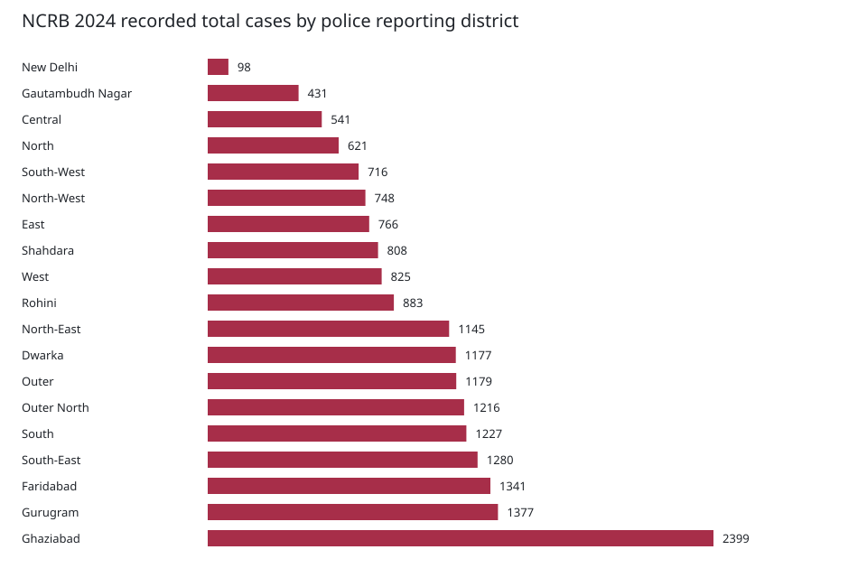
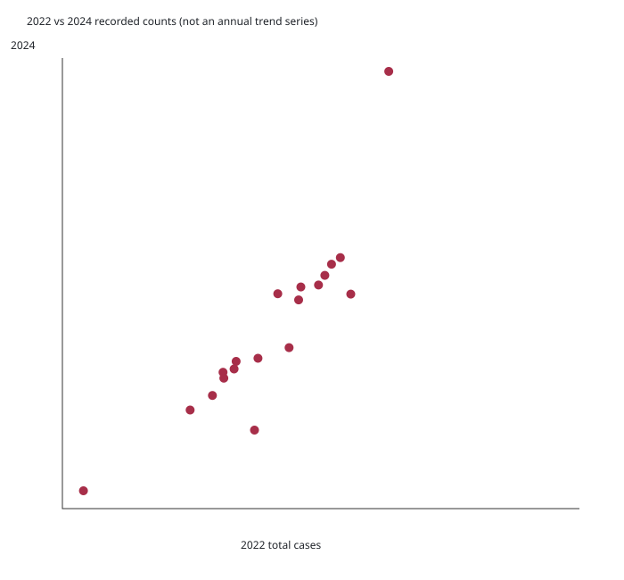
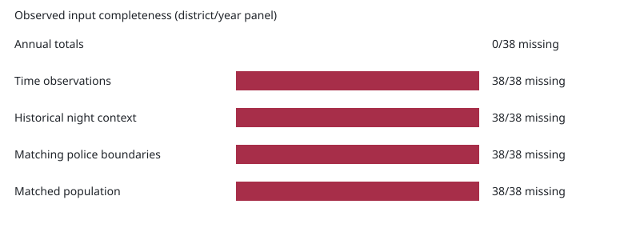

# Counts-v1 exploratory data analysis

Source-backed observations: 38, 19 reporting units, years 2022 and 2024. Latest usable local original district workbook year: 2024. Special units are reconciled separately, not modelled. No 2023 or time-band observations are invented.

## Distributions, two-year changes and outliers

Across the two-year panel: min 98, median 1005.5, mean 1002.9, max 2399 total recorded cases. Tukey upper fence 1959.8; flagged rows [('Ghaziabad', 2024, 2399)]. These are descriptive outliers, not errors or danger classifications.

GBN changes from 940 to 431; Ghaziabad from 1,597 to 2,399. The available files do not establish whether this reflects crime incidence, reporting, recording, legal scope or geography changes. Two observations do not constitute a reliable annual trend. Delhi's geographic districts must be kept separate from special-unit totals and NCRB metropolitan tables.

## Missingness

| Input | Missing among 38 district/year observations | Consequence |
|---|---:|---|
| Explicit annual total | 0 | Usable recorded-count labels |
| Observed four-hour/day-type counts | 38 | Assumed neutral factors only |
| Complete historical night context | 38 | Count-only ablations |
| Matching verified police-district boundary | 38 | No downscaling or district area |
| Matched district population | 38 | No population bias correlation |

Blank raw values stay missing. Source adult/girl stalking columns disagree with parent stalking totals in all 19 selected 2024 districts; category differences are saved in evaluation.json. Explicit reported annual totals, not the inconsistent child sums, are labels. All six state/year sums equal the original workbook state total. This is reconciliation, not independent verification of every source case.

## Correlations and spatial autocorrelation

Temporal count-order Spearman (2022 versus 2024): 0.916. Correlation with police-district area: unavailable. Correlation with matched police-district population: unavailable. Moran's I: unavailable without matching boundaries/adjacency. Assigning revenue districts or guessed points would create misleading spatial statistics. None are reported as zero.

## Validation interpretation

| Model (count-only) | District holdout MAE | RMSE | Spearman | Top-20% hit rate |
|---|---:|---:|---:|---:|
| historical_count | 136.26 | 238.33 | 0.916 | 75% |
| poisson_glm | 157.65 | 264.72 | 0.891 | 75% |
| lightgbm_poisson | 242.57 | 398.75 | 0.604 | 25% |

The learned fits are whole-district retrospective transfer tests. Persistence has a genuine 2022→2024 forecast comparison; learned models do not have an earlier independent temporal fit. One observation per non-Delhi city makes city-specific claims weak. Cross-state counts are not normalized rates and should not be interpreted as comparable individual danger. See MODEL_CARD.md and evaluation.json for calibration, uncertainty, limitations and exact fold identities.
